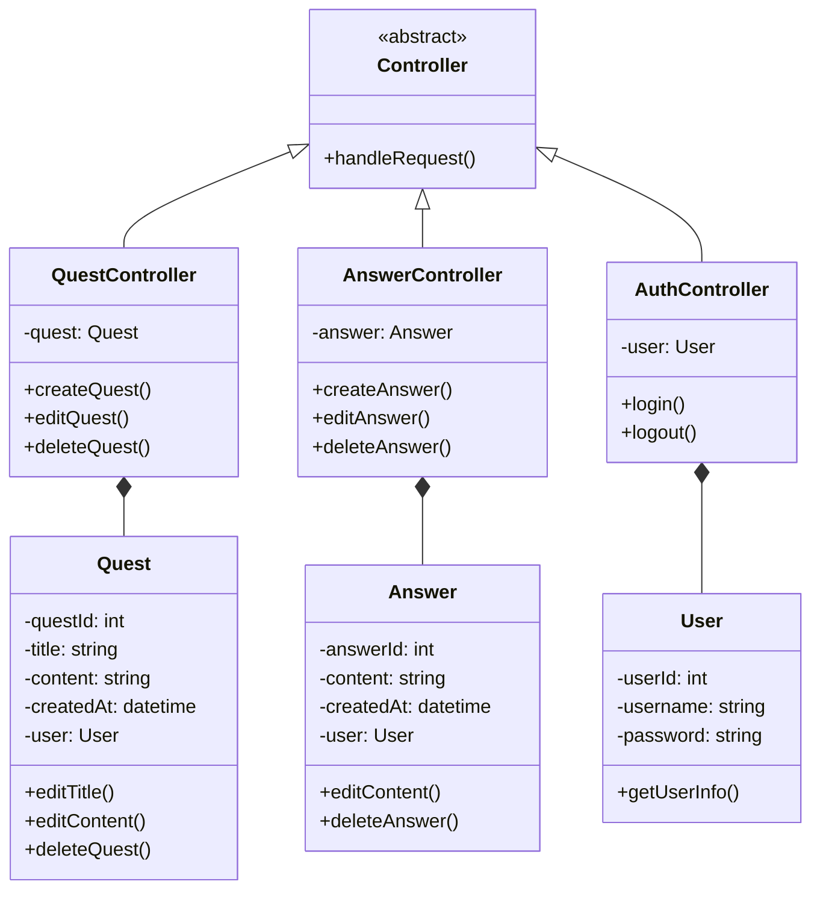

# Prak-PBO
### Nama   : Muhamad Iqbal Fauzi
### NIM   : 1217050085
## Kelas   : Prak PBO D

# Jawaban Soal UTS
## 1. Mampu mendemonstrasikan penyelesaian masalah dengan pendekatan matematika dan algoritma pemrograman secara tepat

1. Basis Data:
Untuk menyimpan pertanyaan dan jawaban, saya menggunakan basis data relasional menggunakan SQL. Basis data ini akan memungkinkan kita untuk menyimpan dan mengelola data dengan efisien.

2. Penampilan Pertanyaan dan Jawaban:
   - Setiap pertanyaan dan jawaban dapat disimpan dalam objek yang memiliki atribut Title, question, author, dan created_at.
   - Untuk menampilkan pertanyaan dan jawaban, kita saya menggunakan Library React typescript untuk merancang tampilan yang sesuai. Pada bagian backend, Saya menggunakan bahasa pemrograman PHP sebagai restAPI yang menghubungkan data dari penyimpanan dan menyajikannya ke pengguna.

3. Membuat Pertanyaan dan Jawaban:
   - Ketika seorang pengguna ingin membuat pertanyaan atau jawaban, saya menyediakan formulir input di halaman yang relevan. Data yang dimasukkan oleh pengguna dapat dikirim ke server melalui permintaan HTTP POST.
   - Di sisi server, saya menggunakan framework Laravel untuk menangani permintaan dan menyimpan data pertanyaan atau jawaban yang baru dibuat ke penyimpanan yang sesuai.

4. Mengedit Pertanyaan dan Jawaban:
   - Ketika seorang pengguna ingin mengedit pertanyaan atau jawaban, saya menyediakan tautan atau tombol "Edit" di samping pertanyaan atau jawaban tersebut.
   - Ketika pengguna mengklik tautan atau tombol "Edit", halaman pengeditan akan ditampilkan dengan formulir yang berisi data pertanyaan atau jawaban yang ada. Pengguna dapat mengubah data yang ada dan mengirimkan permintaan HTTP POST ke server.
   - Di sisi server, diperbarui data pertanyaan atau jawaban yang ada dalam penyimpanan dengan data yang baru dikirimkan oleh pengguna.

5. Menghapus Pertanyaan dan Jawaban:
   - Ketika seorang pengguna ingin menghapus pertanyaan atau jawaban, saya ingin menyediakan tautan atau tombol "Hapus" di dalam option edit.
   - Ketika pengguna mengklik tautan atau tombol "Hapus", permintaan HTTP DELETE akan dikirimkan ke server untuk menghapus pertanyaan atau jawaban yang sesuai dengan index yang dipilih oleh pengguna.

6. Login dan Logout:
   - Untuk login, saya ingin menyediakan formulir login di halaman login yang meminta pengguna untuk memasukkan email dan kata sandi. Data tersebut akan dikirimkan ke server melalui permintaan HTTP POST.
   - Di sisi server, saya membuat logika untuk memeriksa apakah email dan kata sandi yang dimasukkan oleh pengguna cocok dengan data yang ada dalam penyimpanan. Jika cocok, kita dapat mengatur sesi login untuk pengguna dan memberikan akses ke fitur-fitur yang memerlukan otentikasi.
   - Untuk logout, saya ingin menyediakan tautan atau tombol "Logout" di halaman yang sesuai. Ketika pengguna mengklik tautan atau tombol "Logout", sesi login akan dihapus dan pengguna akan diarahkan kembali ke halaman login.

  untuk implementasi program nya dapat dilihat pada code program berikut :
tampilkan, membuat,  edit dan hapus pertanyaan  :
tampilkan, membuat,  edit dan hapus jawaban :
Login & logout  : 

## 2. Mampu menjelaskan algoritma dari solusi yang dibuat
Tentu! Berikut adalah penjelasan singkat tentang beberapa algoritma yang dapat digunakan dalam solusi yang telah dijelaskan sebelumnya:

1. Algoritma menampilkan Pertanyaan dan Jawaban:
   - Algoritma ini melibatkan langkah-langkah berikut:
     - Mengambil data pertanyaan dan jawaban dari database.
     - Mengurutkan pertanyaan dan jawaban berdasarkan id.
     - Menampilkan pertanyaan dan jawaban dalam tampilan web.

2. Algoritma Membuat Pertanyaan dan Jawaban:
   - Algoritma ini melibatkan langkah-langkah berikut:
     - Menerima data masukan dari pengguna melalui formulir.
     - Memvalidasi data masukan, misalnya, memastikan bahwa data yang dimasukkan tidak kosong atau sesuai format yang diinginkan.
     - Menyimpan data pertanyaan atau jawaban yang baru dibuat ke database.

3. Algoritma Mengedit Pertanyaan dan Jawaban:
   - Algoritma ini melibatkan langkah-langkah berikut:
     - Menerima permintaan pengguna untuk mengedit pertanyaan atau jawaban tertentu.
     - Mengambil data pertanyaan atau jawaban yang ada dari database, id pertanyaan atau jawaban sesuai pengguna yang sedang login.
     - Menampilkan formulir pengeditan yang berisi data yang ada.
     - Menerima data pengeditan dari pengguna melalui formulir.
     - Memperbarui data pertanyaan atau jawaban yang ada dengan data yang baru.

4. Algoritma Menghapus Pertanyaan dan Jawaban:
   - Algoritma ini melibatkan langkah-langkah berikut:
     - Menerima permintaan pengguna untuk menghapus pertanyaan atau jawaban tertentu.
     - Mengambil data pertanyaan atau jawaban yang ada dari database.
     - Menghapus data pertanyaan atau jawaban tersebut dari database.

5. Algoritma Login dan Logout:
   - Algoritma ini melibatkan langkah-langkah berikut:
     - Menerima data masukan dari pengguna melalui formulir login.
     - Memverifikasi data masukan dengan data login yang valid dalam database.
     - Mengatur sesi login untuk pengguna yang berhasil login.
     - Menghapus sesi login untuk pengguna yang berhasil logout.

untuk implementasi program nya dapat dilihat pada code program berikut :
tampilkan, membuat,  edit dan hapus pertanyaan  :
tampilkan, membuat,  edit dan hapus jawaban :
Login & logout  : 

## 3. Mampu menjelaskan Konsep dasar OOP
### 1. Inheritance

Inheritance adalah mekanisme dalam pemrograman berorientasi objek di mana sebuah class mewarisi properti dan metode dari class lain yang disebut superclass atau parent class. Class yang menerima warisan disebut subclass atau child class. Dengan menggunakan inheritance, kita dapat mengatur hierarki class dan mewarisi sifat-sifat umum dari class yang sudah ada, sehingga mengurangi duplikasi kode dan mempermudah pemeliharaan.

### 2. Encapsulation

Encapsulation adalah konsep dalam pemrograman OOP yang menggabungkan data dan metode dalam satu unit yang disebut objek. Dalam encapsulation, data (variabel) di dalam objek dibungkus (encapsulated) bersama metode-metode (fungsi) yang beroperasi pada data tersebut. Tujuan utama encapsulation adalah untuk menyembunyikan detail implementasi dari luar, sehingga objek hanya dapat diakses melalui metode yang telah ditentukan.

### 3. Abstraction

Abstraction adalah proses menyembunyikan detail implementasi dan hanya menampilkan fungsionalitas yang relevan. Dalam pemrograman OOP, abstraction dicapai melalui pembuatan class abstract yang tidak dapat diinstansiasi, dan class-class turunan yang mengimplementasikan fungsionalitas yang abstrak tersebut.

### 4. Polymorphism

Polymorphism adalah konsep dalam pemrograman OOP yang mengizinkan penggunaan suatu interface yang sama oleh objek-objek dengan jenis yang berbeda. Dengan polymorphism, objek-objek dengan jenis yang berbeda dapat dianggap sebagai objek dari tipe yang sama saat digunakan dalam operasi atau pemanggilan metode.

## 4. Mampu mendemonstrasikan penggunaan Encapsulation secara tepat

Link Source Code : https://github.com/MiqbalF2021/Prak-PBO-BrainlyClone/blob/main/brainly-api/app/Models/User.php

## 5. Mampu mendemonstrasikan penggunaan Abstraction secara tepat

Link Source Code : https://github.com/MiqbalF2021/Prak-PBO-BrainlyClone/blob/main/brainly-api/app/Http/Controllers/AuthenticationController.php

Pada Program diatas Interface "Authenticator" adalah contoh abstraksi dalam kode program tersebut.
Interface tersebut mendefinisikan metode yang harus diimplementasikan oleh kelas yang menggunakannya tanpa memberikan detail implementasi.
Kelas "AuthenticationController" mengimplementasikan metode-metode tersebut dengan memberikan implementasi spesifik untuk setiap metode.

## 6. Mampu mendemonstrasikan penggunaan Inheritance dan Polymorphism secara tepat

Link Source Code : https://github.com/MiqbalF2021/Prak-PBO-BrainlyClone/blob/main/brainly-api/app/Http/Controllers/AnswerController.php

## 7. Mampu menerjemahkan proses bisnis ke dalam skema OOP secara tepat. Bagaimana cara Kamu mendeskripsikan proses bisnis (kumpulan use case) ke dalam OOP

1. Identifikasi Objek:
Identifikasi objek-objek yang terlibat dalam proses bisnis. Objek-objek ini akan menjadi kelas-kelas dalam OOP. Misalnya, dalam konteks website Brainly, beberapa objek yang terlibat adalah "Pertanyaan", "Jawaban", "Pengguna", "Sesi Login", dll.

2. Identifikasi Atribut dan Metode:
Untuk setiap objek, identifikasi atribut-atribut yang relevan (data yang mereka miliki) dan metode-metode (fungsi yang dapat mereka lakukan). Misalnya, objek "Pertanyaan" dapat memiliki atribut seperti title, pertanyaan, dan created_at, serta metode seperti "update()" dan "destroy()".

3. Definisikan Kelas:
Gunakan konsep kelas dalam OOP untuk mendefinisikan kelas-kelas berdasarkan objek-objek yang diidentifikasi sebelumnya. Setiap kelas akan berisi atribut-atribut dan metode-metode yang relevan. Misalnya, Anda dapat membuat kelas "Pertanyaan" dengan atribut-atribut yang sesuai dan metode-metode seperti "update()" dan "destroy()".

4. Hubungan Antar Kelas:
Identifikasi hubungan antar kelas. Dalam OOP, hubungan ini dapat diwujudkan dalam bentuk pewarisan (inheritance), asosiasi (association), atau komposisi (composition). Misalnya, kelas "Jawaban" mungkin memiliki hubungan asosiasi dengan kelas "Pertanyaan" karena setiap jawaban terkait dengan satu pertanyaan.

## 8. Mampu menjelaskan rancangan dalam bentuk Class Diagram, dan Use Case table
### Class Diagram




### UseCase Table
| No | UseCase | Prioritas (%) | terimplementasi |
|---------|---------|---------|---------|
| 1 | User dapat mengajukan pertanyaan    | 10   | Y |
| 2 | User dapat menjawab pertanyaan    | 10    | Y |
| 3 | User dapat mengedit pertanyaanya    | 9    | Y |
| 4 | User dapat menghapus pertanyaannya    | 9    | Y |
| 5 | User dapat mengedit jawabannya    | 9    | Y |
| 6 | User dapat menghapus jawabannya    | 9    | Y |
| 7 | User dapat login    | 7    | Y |
| 8 | User dapat logout    | 7   | Y |
| 9 | dapat menampilkan pertanyaan dan jawaban  | 9    | Y |

## 9. Mampu memberikan gambaran umum aplikasi kepada publik menggunakan presentasi berbasis video

Link Vidio : https://youtu.be/TrvG1pSM2bU

## 10. Inovasi UX


# Jawaban Soal UAS
## 1. Mampu menunjukkan keseluruhan Use Case beserta ranking dari tiap Use Case dari produk digital
### UseCase user Table
| No | UseCase | Prioritas (%) | terimplementasi |
|---------|---------|---------|---------|
| 1 | User dapat mengajukan pertanyaan    | 10   | Y |
| 2 | User dapat menjawab pertanyaan    | 10    | Y |
| 3 | User dapat mengedit pertanyaanya    | 9    | Y |
| 4 | User dapat menghapus pertanyaannya    | 9    | Y |
| 5 | User dapat mengedit jawabannya    | 9    | Y |
| 6 | User dapat menghapus jawabannya    | 9    | Y |
| 7 | User dapat login    | 7    | Y |
| 8 | User dapat logout    | 7   | Y |
| 9 | dapat menampilkan pertanyaan dan jawaban  | 9    | Y |

## 2. Mampu mendemonstrasikan Class Diagram dari keseluruhan Use Case produk digital


## 3. Mampu menunjukkan dan menjelaskan penerapan setiap poin dari SOLID Design Principle

1. Single Responsibility Principle (SRP):
Prinsip ini menyatakan bahwa setiap kelas atau modul dalam perangkat lunak seharusnya hanya memiliki satu tanggung jawab tunggal.
contoh implementasi :

```
class AuthenticationController implements Authenticator
{
    public function login(Request $request)
    {
        $request->validate([
            'email' => 'required|email|string',
            'password' => 'required|string',
        ]);  

        $user = User::where('email', $request->email)->first();

        if (! $user || ! Hash::check($request->password, $user->password)) {
            throw ValidationException::withMessages([
                'email' => ['The provided credentials are incorrect.'],
            ]);
        }
        return $user->createToken('login user')->plainTextToken;
    }

    public function logout(Request $request)
    {
        $request->user()->currentAccessToken()->delete();
    }
```

pada source coe diatas class AuthenticationController hanya memiliki tugas untuk authentikasi

2. Open-Closed Principle (OCP):
Prinsip ini menyatakan bahwa entitas perangkat lunak (kelas, modul, fungsi, dll.) harus terbuka untuk perluasan (open for extension) tetapi tertutup untuk modifikasi (closed for modification).

3. Liskov Substitution Principle (LSP):
Prinsip ini menyatakan bahwa objek dari kelas turunan harus dapat digunakan sebagai pengganti objek kelas dasarnya tanpa mengubah kebenaran program. Ini berarti kelas turunan harus mematuhi kontrak dan perilaku yang telah ditetapkan oleh kelas dasarnya. Dengan mematuhi prinsip ini, kita dapat menghindari perubahan yang tak terduga dan memastikan bahwa polimorfisme berfungsi dengan benar.

4. Interface Segregation Principle (ISP):
Prinsip ini menyatakan bahwa klien tidak boleh dipaksa bergantung pada antarmuka yang tidak mereka gunakan. Sebaliknya, perangkat lunak harus menyediakan antarmuka yang spesifik dan terpisah untuk setiap klien yang menggunakan fungsionalitas tertentu.

5. Dependency Inversion Principle (DIP):
Prinsip ini menyatakan bahwa modul tingkat tinggi tidak boleh bergantung pada modul tingkat rendah secara langsung, tetapi keduanya harus bergantung pada abstraksi.

## 4. Mampu menunjukkan dan menjelaskan Design Pattern yang dipilih
Saya memakan Singleton design sebagai implementasi design pattern pada code program saya, Singleton adalah pola desain (design pattern) yang digunakan untuk memastikan bahwa hanya ada satu instansi (instance) dari sebuah kelas yang dapat dibuat dalam suatu program
Implementasi pada program saya terdapat pada class User :

```
<?php

namespace App\Models;

use Illuminate\Database\Eloquent\Model;
use Illuminate\Foundation\Auth\User as Authenticatable;
use Illuminate\Notifications\Notifiable;
use Laravel\Sanctum\HasApiTokens;

class User extends Authenticatable
{
    use HasApiTokens, Notifiable;

    private static $instance;

    /**
     * Get the singleton instance of User.
     *
     * @return User
     */
    public static function getInstance(): self
    {
        if (self::$instance === null) {
            self::$instance = new self();
        }

        return self::$instance;
    }

    // ... your other code ...

    /**
     * Prevent creating multiple instances of User.
     */
    private function __construct()
    {
        parent::__construct();
    }

    /**
     * Prevent cloning the User instance.
     */
    private function __clone()
    {
    }
}

```
pada code program di atas, saya menambahkan properti $instance yang merupakan instance tunggal dari class User. Metode getInstance() digunakan untuk mendapatkan instance tunggal tersebut. Jika instance belum ada, maka instance baru akan dibuat menggunakan constructor private.

Konstruktor class User dibuat sebagai private untuk mencegah pembuatan multiple instances. Demikian pula, metode __clone() didefinisikan sebagai private agar instance User tidak dapat di-clone.

## 5. 
koneksi ke database pada framework laravel telah di kerjakan pada "config/database.php", untuk mengoneksikan nya ke database kita hanya perlu mengedit pada bagian .env seperti ini :
```
APP_NAME=brainly-api
APP_ENV=local
APP_KEY=base64:9GiXson6yy3p6deKl3Ga0yAt0lLmXikWMoQxyC09LvI=
APP_DEBUG=true
APP_URL=http://localhost

LOG_CHANNEL=stack
LOG_DEPRECATIONS_CHANNEL=null
LOG_LEVEL=debug

DB_CONNECTION=mysql
DB_HOST=127.0.0.1
DB_PORT=3306
DB_DATABASE=brainly-api
DB_USERNAME=root
DB_PASSWORD=
```

## 6. Mampu menunjukkan dan menjelaskan pembuatan web service dan setiap operasi CRUD nya 
pada pembuatan web services ini saya menggunakan framework laravel untuk membuat restAPI, saya akan memberikan panduan singkat untuk menjelaskan implementasi web services menggunakan restAPI saya:
1. route
   Di Laravel, Anda dapat menggunakan metode get, post, put, dan delete untuk mendefinisikan rute untuk operasi CRUD (Create, Read, Update, Delete) yang umum digunakan dalam RESTful API, Berikut route yang saya buat sebagai endpoint :
   ```
      <?php
   
   
   use Illuminate\Support\Facades\Route;
   use App\Http\Controllers\QuestController;
   use App\Http\Controllers\AnswerController;
   use App\Http\Controllers\AuthenticationController;
   
   
   Route::middleware(['auth:sanctum'])->group(function () {
       route::get('/logout', [AuthenticationController::class, 'logout']);
       route::get('/me', [AuthenticationController::class, 'me']);
       route::post('/question', [QuestController::class, 'store']);
       route::patch('/question/{id}', [QuestController::class, 'update'])->middleware('pemilik-pertanyaan');
       route::delete('/question/{id}', [QuestController::class, 'destroy'])->middleware('pemilik-pertanyaan');
   
       route::post('/answer', [AnswerController::class, 'store']);
       route::patch('/answer/{id}', [AnswerController::class, 'update'])->middleware('pemilik-jawaban');
       route::delete('/answer/{id}', [AnswerController::class, 'destroy'])->middleware('pemilik-jawaban');
   });
   route::get('/question', [QuestController::class, 'index']);
   route::get('/question/{id}', [QuestController::class, 'show']);
   
   
   route::post('/login', [AuthenticationController::class, 'login']);

   ```

   routes ini disimpan pada class api.php
3. controller
   untuk mengelola logika bisnis dan pemrosesan data, Dalam metode-metode kontroler, Anda dapat mengambil data dari database, memvalidasi input, dan menghasilkan respon dalam format JSON
   Berikut adalah salah satu class controller saya yaitu class QuestController untuk mengelola logika question:
   ```
   <?php
   
   namespace App\Http\Controllers;
   
   use App\Models\Quest;
   use Illuminate\Http\Request;
   use Illuminate\Support\Facades\Auth;
   use App\Http\Resources\QuestResource;
   use App\Http\Resources\QuestDetailResource;
   
   class QuestController extends Controller
   {
       public function index()
       {
           $quests = Quest::all();
           return QuestDetailResource::collection($quests->loadMissing(['writer:id,name', 'answer:id,quest_id,user_id,is_answer']));
       }
   
       public function show($id)
       {
           $quest = Quest::with('writer:id,name')->findOrFail($id);
           return new QuestDetailResource($quest->loadMissing(['writer:id,name', 'answer:id,quest_id,user_id,is_answer']));
       }
   
       public function store(Request $request)
       {
           $validated = $request->validate([
                   'title' => 'required|max:255',
                   'question' => 'required',
               ]);
   
               $request['author'] = Auth::user()->id;
               $quest = Quest::create($request->all());
   
               return new QuestDetailResource($quest->loadMissing('writer:id,name'));
       }
   
       public function update(Request $request, $id)
       {
         
           $validated = $request->validate([
               'title' => 'required|max:255',
               'question' => 'required',
           ]);
   
           $quest = Quest::findOrFail($id);
           $quest->update($request->all());
   
           return new QuestDetailResource($quest->loadMissing('writer:id,name'));
       }
   
       public function destroy($id)
       {
           $quest = Quest::findOrFail($id);
           $quest->delete();
   
           return new QuestDetailResource($quest->loadMissing('writer:id,name'));
       }
   }

   ```
5. middleware
   middleware Laravel untuk menerapkan otorisasi, otentikasi, atau filter lainnya pada web services. Misalnya, menggunakan middleware auth:sanctum untuk mengamankan rute-rute tertentu dengan autentikasi Sanctum. contohnya bisa dilihat pada routes diatas ada beberapa routes yang memakai auth sanctum
6. validasi
   contoh implementasi validasi adalah untuk memvalidasi pengguna saat login
   berikut adalah method untuk memvalidasi pengguna saat login
   ```
       public function login(Request $request)
    {
        $request->validate([
            'email' => 'required|email|string',
            'password' => 'required|string',
        ]);  

        $user = User::where('email', $request->email)->first();

        if (! $user || ! Hash::check($request->password, $user->password)) {
            throw ValidationException::withMessages([
                'email' => ['The provided credentials are incorrect.'],
            ]);
        }
        return $user->createToken('login user')->plainTextToken;
    }
   ```
7. pengujian
   Pada pengujian tiaap end poind dan operasi CRUD saya menggunakan aplikasi postman.

## 7. Mampu menunjukkan dan menjelaskan Graphical User Interface dari produk digital

## 8. Mampu menunjukkan dan menjelaskan HTTP connection melalui GUI produk digital
   GUI dengan menggunakan react typescript, untuk menghubungkan http requestnya akan menggunakan library pada typescript yaitu axios.
## 9. Mampu Mendemonstrsikan produk digitalnya kepada publik dengan cara-cara kreatif melalui video Youtube

## 10. Bonus: Mendemonstrasikan penggunaan Machine Learning pada produk yang digunakan
